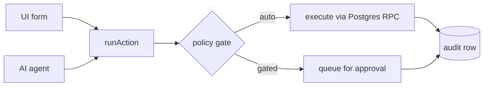

# Chemical Distribution ERP

An ERP for small and mid-sized chemical distributors, built so that AI agents can operate it —
reading emailed purchase orders, drafting sales orders, and managing stock — without ever getting
a code path a human user could not reach.

**Status:** in active development. Feature-complete through order-to-cash and a working document
intake agent; not deployed and not in production use.

```
Next.js 16 · TypeScript (strict) · Supabase (Postgres + RLS) · Tailwind v4 · shadcn/ui · Anthropic API
20 tables · 12 Postgres functions · 22 registry actions · 28 routes · 77 tests
```

---

## The problem

Chemical distributors don't run on tidy web forms. They run on emailed PDFs, WhatsApp
confirmations, and a buyer who writes *"2 drums IPA 99%"* when your catalog says
`SOL-IPA-99 — Isopropyl Alcohol 99%, base unit L`. Someone re-types that into an ERP several
dozen times a day.

That is a good fit for an agent, and a terrible fit for a naive one. Get a quantity wrong and you
ship 400 litres instead of 400 kilograms. Match the wrong product and a customer expecting caustic
soda flakes receives a 32% solution — about a third of the sodium hydroxide they ordered, in a form
they may not be able to use.

So the interesting problem isn't "call a model to read a PDF". It's building a system where an
agent's mistakes are **bounded, visible, and reversible**.

---

## Architecture

### One write path

Every business operation is a typed action. The UI and the agents call the same registry.



There is no second list of agent capabilities to keep in sync. A tool the agent can call *is* an
action, which means approval gating, the audit trail, and undo come for free — and it is
structurally impossible to give an agent a capability the audit log doesn't cover.

```ts
// A server action is a thin wrapper. Nothing else.
export async function addProduct(formData: FormData) {
  await invoke(createProduct, { sku: ..., name: ... })
}
```

Human-initiated actions execute immediately — the person clicking the button is the approval — but
are still audited. Agent-initiated actions are gated by the organization's autonomy policy, by a
value threshold, or by the action's own risk classification. That last one is not overridable:
an org can put `create_sales_order` on auto, but an individual order the action flags as high risk
still stops for a human.

### The domain model most ERPs get wrong

Quantities are `numeric(14,4)`, never `integer` — chemicals ship in fractional kilograms and litres.

- **Base unit of measure.** Every quantity in the database is stored in the product's base unit
  (`kg`, `L`, or `ea`). Conversion happens at the edges.
- **Density.** What makes kg ↔ L conversion possible. A liquid without one *cannot* accept an order
  in the other unit — that raises an error rather than assuming 1.0, because assuming 1.0 for
  isopropyl alcohol overstates a delivery by 27%.
- **Package types.** Customers order in drums, IBCs, and bags; stock is held in base units.
  "10 drums" only becomes a quantity if a drum is defined.
- **Batch / lot.** Products with a shelf life hold their balance on `batches`, not on the product
  row, and allocation is first-expired-first-out — because customers reject short-dated material.

### An append-only ledger

Every stock change writes a `stock_moves` row. The table is append-only, enforced by restrictive
RLS policies blocking `UPDATE` and `DELETE`. Balances on `products` and `batches` are derived state
maintained by SQL functions, never written from application code.

This is what makes agent actions reversible: to undo, post the inverse move. The ledger keeps the
whole story — received, then unreceived — rather than quietly rewriting history.

Operations that must be atomic live in Postgres and are called via RPC: `post_stock_move`,
`create_sales_order`, `allocate_sales_order`, `fulfil_sales_order`, `create_invoice_from_order`,
`receive_purchase_order`. This replaced non-atomic read-modify-write on stock levels, where two
concurrent sales could read the same balance and oversell.

### Tenancy, and the boundary where RLS stops helping

Tenancy is per-organization. Every tenant-owned row carries `org_id`, and RLS policies are uniformly
`using (is_org_member(org_id))`.

Signed-in requests use the anon key, so Postgres enforces isolation. **Agent runs triggered by
webhooks have no user session and use the service role, which bypasses RLS entirely.** On that path,
`org_id` filtering is application code, and a missing filter is a cross-tenant data leak.

Building this surfaced a real vulnerability: five RPCs took only a record id, with no org parameter.
Under RLS that was safe. On the agent path it meant an id belonging to another tenant would have been
honoured. Fixed by asserting ownership before every such call, and by routing all service-role access
through a client that cannot be constructed without an organization.

### The agent layer

`lib/ai/` is the only place that talks to Anthropic.

**PO intake** is a single structured-output call rather than a tool-calling loop. For a catalog of a
few hundred SKUs, putting the whole catalog behind a cached prompt prefix is cheaper and more
accurate than letting the model search one line at a time — it can see every candidate at once.

The design rule that matters:

> An agent that cannot confidently identify a product must leave `product_id` null and flag the line
> for review, not guess. A wrong chemical match is a wrong chemical on a truck.

Unmatched lines block the order from being confirmed or allocated, enforced in SQL as well as in the
UI, so a half-understood order physically cannot reach the warehouse.

Prices work the same way. The model is forbidden from supplying a price the document doesn't state;
application code falls back to the catalog list price. A deterministic lookup can't mis-transcribe a
figure — and a wrong price is an invoice someone has to retract.

**The system learns.** When a human resolves an unmatched line, that correction is recorded as a
per-customer alias and resolved deterministically on future documents — before the model runs.
Repeat orders, which are most of a distributor's volume, converge on needing no model call at all.

**Agents never author regulatory data.** Hazard class, UN number, packing group, and SDS content
carry shipping and legal liability. When that layer lands it will be a curated table agents *read
and cite*, never write. This is enforced structurally: no action exists that writes those fields.

---

## Running it

Requires Node 20+ and a Supabase project.

```bash
npm install
cp .env.example .env.local   # fill in the values below
```

```
NEXT_PUBLIC_SUPABASE_URL=
NEXT_PUBLIC_SUPABASE_ANON_KEY=
SUPABASE_SERVICE_ROLE_KEY=     # server-only — never NEXT_PUBLIC_
ANTHROPIC_API_KEY=             # server-only
INBOUND_WEBHOOK_SECRET=        # optional, enables the email webhook
INBOUND_ORG_ID=
```

In the Supabase SQL editor, run in order:

1. `supabase/schema.sql` — tables, RLS, triggers
2. `supabase/functions.sql` — the atomic operations
3. `supabase/seed.sql` — a sample distributor (edit `v_email` first)

Then `notify pgrst, 'reload schema';` so PostgREST picks up the new tables.

Sign-up is invite-only: create your user in Dashboard → Authentication → Users.

```bash
npm run dev
```

### Trying the intake agent

```bash
npm run inbound
```

Posts an HMAC-signed message to the inbound webhook without needing a mail provider. The default
payload deliberately includes a quoted reply mentioning a *different* product, so a regression in
quoted-history stripping shows up as a changed order.

```bash
node scripts/send-inbound-email.mjs --text "3 x 250 L drums NaOH 32%"
node scripts/send-inbound-email.mjs --message-id "<seen@before>"   # dedup
node scripts/send-inbound-email.mjs --bad-signature                # expect 401
```

---

## Testing

```bash
npm run test        # Vitest
npm run typecheck   # tsc --noEmit, zero errors
npm run lint
```

77 tests, covering the places where a silently wrong answer ships as a wrong quantity of a chemical:
unit conversion and the missing-density error, package expansion, price resolution, quoted-reply
stripping, and the autonomy gate that decides whether an agent acts alone. No database or network —
these are pure functions by design.

The email tests earned their place immediately: they caught a regex that required every quoted line
to end in a newline, so the final line of a reply chain never matched and nothing was stripped.

---

## Known gaps

Honest list of what isn't done:

- **Multi-lot allocation.** A line can only draw from one lot; an order larger than a single lot is
  refused rather than silently corrupting the ledger. Needs a join table.
- **Customer-specific pricing.** Everyone gets list price. Real distributors run negotiated rates.
- **No delete-line action.** An order containing something you genuinely don't stock can't proceed.
- **Regulatory layer.** CAS/UN/GHS/SDS deferred; the schema leaves room for it.
- **Not deployed**, and the invoice PDF lacks the seller's registration details a Malaysian SST
  invoice legally requires.

---

## Layout

```
app/(dashboard)/        inbox, agents, customers, orders, invoices,
                        inventory, suppliers, purchase-orders, reports, settings
lib/erp/actions/        the action registry — the only write path
lib/erp/                uom, pricing, aliases, email parsing, queries
lib/ai/                 Anthropic client, registry→tool bridge, PO intake agent
supabase/               schema, atomic functions, seed, reset
proxy.ts                Next 16's renamed middleware — session refresh + auth
```
